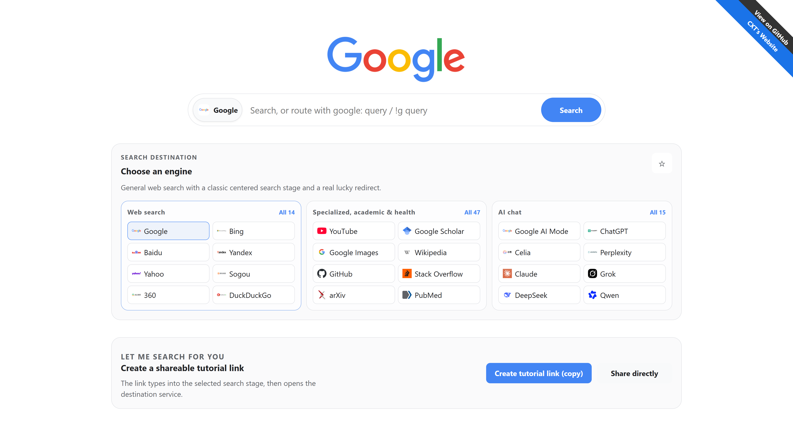

# SearchAIO — Das All-in-One-Suchportal

 

**SearchAIO** bündelt klassische Suchmaschinen und moderne KI-Chats in einem täglichen Suchzentrum und erstellt teilbare Links, die den vollständigen Suchablauf zeigen.

**[📖 Projektvorstellung](https://www.cxthhhhh.com/search-aio/)** | **[➡️ Online-Demo](https://www.cxthhhhh.com/CXT-Lib/SearchAIO/)**

<a href="../../README.md">English</a> | <a href="README.zh-CN.md">简体中文</a> | <a href="README.ru.md">Русский</a> | <a href="README.es.md">Español</a> | <a href="README.fr.md">Français</a> | <a href="README.ar.md">العربية</a> | <a href="README.pt-BR.md">Português (Brasil)</a> | <a href="README.ja.md">日本語</a> | <b>Deutsch</b>

---

## ✨ Funktionen

- **Zwei Funktionen**: persönliche Startseite für 76 Dienste oder Tutorial-Links, die den gesamten Ablauf zeigen.
- **Breite Unterstützung**: Google, Bing, Baidu, Yandex, DuckDuckGo, ChatGPT, Copilot, Perplexity und mehr.
- **Internationalisierung**: Chinesisch, Englisch, Russisch, Spanisch, Französisch, Arabisch, brasilianisches Portugiesisch, Japanisch und Deutsch; die Auswahl wird lokal gespeichert.
- **Helles/dunkles Thema**, responsives Layout und keine Laufzeitabhängigkeiten.
- **Beschreibungen der Suchziele** erleichtern die Werkzeugauswahl.

---

## 🚀 Verwendung

### Als persönliches Suchzentrum

https://github.com/user-attachments/assets/41f9c122-5d37-46cb-99c3-886bb2dab3d0

1. Öffnen Sie die **[Online-Demo](https://www.cxthhhhh.com/CXT-Lib/SearchAIO/)**.
2. Wählen Sie eine Suchmaschine aus der Liste.
3. Geben Sie die Anfrage in das Suchfeld ein.
4. Drücken Sie `Enter` oder die Suchtaste, um in einem neuen Tab zu suchen.

### Tutorial-Link erstellen

https://github.com/user-attachments/assets/0bb11175-036f-464b-b8a1-6721d973e057

1. Öffnen Sie die **[Online-Demo](https://www.cxthhhhh.com/CXT-Lib/SearchAIO/)**.
2. Wählen Sie die vorzuführende Suchmaschine.
3. Geben Sie die Frage in das Suchfeld ein.
4. Klicken Sie auf **„Tutorial-Link erstellen (kopieren)“**.
5. Wenn verfügbar, öffnet **„Direkt teilen“** die Systemfreigabe.
6. Senden Sie den Link an die Person, die den Suchablauf lernen soll.

---

## 🛠️ Technik-Stack

- **HTML5**
- **CSS3** (CSS-Variablen für Themen)
- **Vanilla JavaScript** (ES6+)

`SearchAIO.html` ist die Quelldatei; für die Bereitstellung wird sie in `index.html` umbenannt. Der Code ist in Suchmaschinenregister, i18n, Einstellungen, URL-Routing, Tutorial-Animation und UI-Module aufgeteilt. Direktes Öffnen verwendet die standalone runtime, HTTP-Bereitstellungen verwenden ES Modules.

## ⌨️ Direktes Routing und Wartung

- Nutzen Sie `google: Anfrage` oder `!g Anfrage`; die Tooltips der Buttons zeigen deren Aliasse.
- `Ctrl/Cmd + K` fokussiert die Suche, `Alt + ↑/↓` wechselt die Suchmaschine und `Esc` schließt Vorschläge oder Dialoge.
- Favoriten bleiben im aktuellen Browser; der Suchverlauf wird nicht erfasst.
- Nach Änderungen am Register öffnen Sie `SearchAIO.html?selftest=1` oder führen `npm test` aus.
- Nach Änderungen an `src/*.js` führen Sie `npm run build:static` aus und benennen `SearchAIO.html` in `index.html` um.

Siehe [ARCHITECTURE.md](../../ARCHITECTURE.md).

---

## 🤝 Mitwirken

Beiträge, Fehlerberichte und Wünsche sind willkommen; siehe [issues](https://github.com/MeowLove/SearchAIO/issues).

## 📄 Lizenz

Das Projekt steht unter **GPL-3.0**. Details in [LICENSE](https://github.com/MeowLove/SearchAIO/blob/main/LICENSE).
